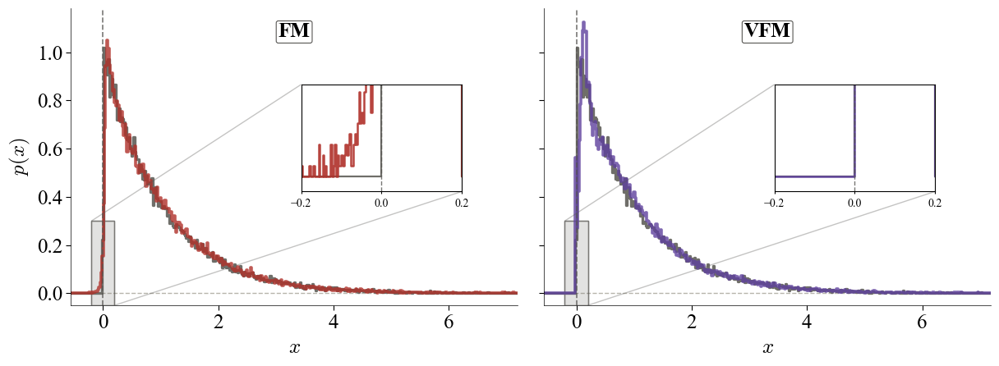

# 🌀 Pawsterior: Variational Flow Matching for Structured Simulation-Based Inference 🌀

This is the main repository of the paper **[Pawsterior: Variational Flow Matching for Structured Simulation-Based Inference](https://arxiv.org/abs/2602.13813)**, accepted at GRaM 2026 (ICLR workshop).

**Authors**: Jorge Carrasco-Pollo* Floor Eijkelboom*, Jan-Willem van de Meent.

\* equal contribution

## Abstract
We introduce Pawsterior, a variational flow-matching framework for improved and extended simulation-based inference (SBI). Many SBI problems involve posteriors constrained by structured domains—such as bounded physical parameters or hybrid discrete–continuous variables—yet standard flow-matching methods typically operate in unconstrained spaces. This mismatch leads to inefficient learning and difficulty respecting physical constraints. Our contributions are twofold. First, generalizing the geometric inductive bias of CatFlow, we formalize endpoint-induced affine geometric confinement, a principle that incorporates domain geometry directly into the inference process via a two-sided variational model. This formulation improves numerical stability during sampling and leads to consistently better posterior fidelity, as demonstrated by improved classifier two-sample test performance across standard SBI benchmarks. Second, and more importantly, our variational parameterization enables SBI tasks involving discrete latent structure (e.g., switching systems) that are fundamentally incompatible with conventional flow-matching approaches. By addressing both geometric constraints and discrete latent structure, Pawsterior extends flow-matching to a broader class of structured SBI problems that were previously inaccessible.

___

## TL;DR

This repo implements **endpoint-based variational flow matching** for **simulation-based inference (SBI)** with structured supports:
- **Continuous bounded supports** (e.g. sbibm tasks with box constraints)
- **Categorical / switching latent structure** via a custom **Switching Gaussian Mixture (SGM)** task


<p align="center">
    
</p>

## Repository layout (high-level)

```
configs/
  run.yaml                 # single run config
  tasks.yaml               # task metadata 
  sweeps/
    sbibm_sweep.yaml       # sweep template for sbibm
    sgm_sweep.yaml         # sweep template for SGM (Categorical task)
jobs/
  launch_sweep.sh          # submits Slurm array sweep
  launch_train_eval.sh     # submits Slurm single run
  sweep_array.job          # Slurm array job definition
  train_eval.job           # Slurm single-job definition
src/
  cli.py                   # CLI entrypoint 
  experiment.py            # training + evaluation wrapper
  sweep.py                 # streaming sweep logic (keep-best)
  tasks.py                 # task loader (sbibm + custom SGM)
  models/                  # model implementations 
artifacts/                 # results / checkpoints / best.json (created at runtime)
```

---

## Installation

```bash
# 1.- Clone
git clone https://github.com/Carrask0/pawsterior.git
cd pawsterior

# 2.- Install and activate the environment
conda env create -f environment.yaml
conda activate pawsterior_env
```


---

## Running experiments locally

All experiments are executed via the CLI:

- **Single run:** `python -m src.cli run --config ... [--override ...]`
- **Sweep run (one grid index):** `python -m src.cli sweep-index --config ... --grid-index N`

### A) Single train + evaluate

Uses `configs/run.yaml` by default.

```bash
python -m src.cli run --config configs/run.yaml
```

Override fields directly from the CLI (dotted keys):
```bash
python -m src.cli run --config configs/run.yaml \
  --override run.task_name=two_moons run.model=x0x1 run.init_dist=gaussian run.n_train=1000 \
            params.hidden_dim=512 params.num_blocks=16 params.learning_rate=1e-4 params.alpha=0.0
```

**Supported models (as in `configs/run.yaml`):**
- `x0x1` (two-sided endpoint VFM)
- `x1` (one-sided endpoint VFM)
- `velocity` (standard velocity regression baseline)

**Supported init distributions:**
- `gaussian`
- `theta_prior`

### B) Running a sweep locally

Run one grid index from a sweep config:
```bash
python -m src.cli sweep-index --config configs/sweeps/sgm_sweep.yaml --grid-index 0
```

---

## Running experiments on a Slurm cluster

This repo provides `jobs/*.job` scripts plus launchers.

### A) Sweeps (array jobs)

Edit `jobs/launch_sweep.sh` and select a sweep config, e.g.
- `configs/sweeps/sbibm_sweep.yaml`
- `configs/sweeps/sgm_sweep.yaml`

Submit:
```bash
bash jobs/launch_sweep.sh
```

This submits an array job: 
- Each array task runs exactly **one** `grid-index`
- Each grid-index trains + evaluates once
- Only the **current best** checkpoint is kept (others are deleted)


### B) Single run job

Edit `jobs/launch_train_eval.sh` (task/model/init_dist/n_train), then:
```bash
bash jobs/launch_train_eval.sh
```

This runs:
```bash
python -m src.cli run --config "$CONFIG" \
  --override run.task_name="$TASK_NAME" run.model="$MODEL" run.init_dist="$INIT_DIST" run.n_train="$N_TRAIN"
```


## BibTeX

```
@misc{carrascopollo2026pawsteriorvariationalflowmatching,
      title={Pawsterior: Variational Flow Matching for Structured Simulation-Based Inference}, 
      author={Jorge Carrasco-Pollo and Floor Eijkelboom and Jan-Willem van de Meent},
      year={2026},
      eprint={2602.13813},
      archivePrefix={arXiv},
      primaryClass={cs.LG},
      url={https://arxiv.org/abs/2602.13813}, 
}
```

[sbibm]: <https://arxiv.org/abs/2101.04653> "sbibm"

